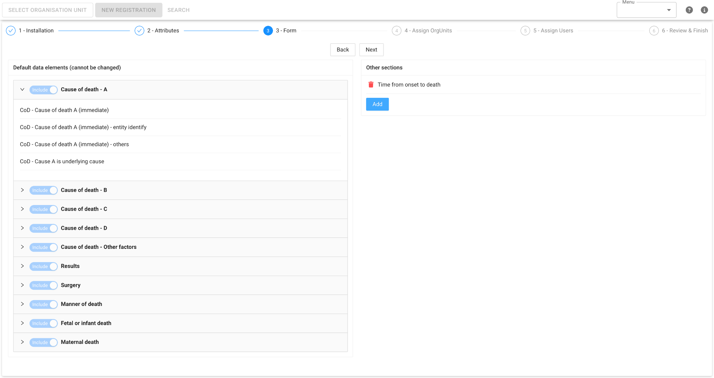

# ICD-11 Cause of Death Mortality App - Installation Guide

The **\"ICD-11 Cause of Death\"** app is published in the [DHIS2 App Hub](https://apps.dhis2.org/). Search for the app and upload it to your DHIS2 instance.

Alternatively, you can use the **"Download ICD-11 CoD app"** link in the "WHO COD Resource" dashboard from the demo site: [https://dhis2.world/whocod/](https://dhis2.world/whocod/) to download the app bundle and upload it to Custom App in App Management.

After uploading the app in the instance, an installation page will appear when you first launch the app. This installation process ensures that Tracked Entity Attributes are mapped between the instance and the Cause of Death program. It also imports other program metadata, such as Data Elements, Option Sets, and Program configurations. You must complete this setup to access other modules in the app.

> **Note**: It is recommended that you try the installation process, as well as the ICD-11 app itself, on a development instance that is a copy of your production system. This will allow you to quickly reset the instance if the results are not consistent with your expectations, or you run into errors during the installation process itself.

## Default and Custom Installation

At this step, the app needs to determine which ICD Coding Tool will be used, as it will be embedded in the Data Entry form. If you have an existing ICD Coding Tool and want to use it, select \"Use other ICD Tool URL\" and provide the hosted URL. Otherwise, select \"Use global WHO ICD Tool\" to use the tool implemented and hosted on the WHO server.

There are two installation options for the app: Default Installation and Custom Installation.

1.  Default Installation is for instances that do not have any Tracked Entity Attributes (TEAs) or Tracked Entity Types (TETs). This option is recommended in locations where there is no existing DHIS2 metadata, as it imports pre-defined TEAs, TETs, and other metadata from the app source.

2.  Custom Installation is for instances that are already in use and have existing TEAs and TETs. This option includes additional steps to map the TEAs and TETs between the instance and the app while importing the necessary metadata. It also allows you to add extra TEAs and other sections in the Data Entry form.

> **Note**: Instances that have already configured and implemented DHIS2 Tracker for any health program should not use the default installation method, as it may create duplicate attributes such as name, sex, and date of birth. Instead, the Custom Installation option should be used to properly map your existing attributes.***

You must select either Default Installation or Custom Installation to proceed to the next step.

## **Attributes** (Custom Installation only)

This step when using the custom installation is for mapping TEAs between the instance and the app.

On the left side, the app displays the TET along with all mandatory attributes, such as Date of Birth. Each mandatory attribute has a dropdown menu containing all TEAs in the instance that use the same value type. Select the appropriate TEA from your own system within the dropdown to map it to the corresponding mandatory attribute in the app.

There are options for mapping the Person's Name, which determine whether the dropdowns for First Name, Middle Name, and Last Name are enabled:

-   No Name: No need to map Given Name, Middle Name, and Last Name

-   Full Name: Only requires mapping Given Name

-   First and Last Name: Requires mapping Given Name and Last Name

-   First, Middle and Last Name: Requires mapping Given Name, Middle Name, and Last Name

The Female Option is used for rules in the Data Entry form. If the Sex attribute\'s value matches the Female Option, it will trigger specific rules in the form. Therefore, it is important to assign the correct value for the Female Option during this setup.

If you want to add additional attributes that are not mandatory in the app, you can use the Other Attributes Transfer Table on the right side. This table includes all tracked entity attributes from the instance in the \"Available Attributes\" list. You can select the attributes you need and transfer them to the \"Selected Attributes\" list.

You must map all the mandatory attributes and TET to proceed to the next step.

## **Form** (Custom Installation only)

This step in the custom installation allows you to add additional sections to the Data Entry form alongside the default sections.

> **Note**: you can not remove any of the default sections during or after installation. This is because all of the inputs from these sections are required for DORIS to accurately select the underlying cause of death***

On the left side, you will see a list of Default Sections, which cannot be modified. You can expand these sections to view all their Data Elements (DEs).

On the right side, you can add Other Sections by clicking the \"Add\" button. This will open a pop-up where you can set up a new section.

In the pop-up, enter a title for your section in the Section Name field. Then, select the DEs from the Available DEs list and transfer them to the Selected DEs list.

Once you\'ve selected the DEs for the new section, click the \"OK\" button to save it in the configuration.

## Assigning organisation units

This step is required for both Default and Custom Installation to assign organisation units where data collection for the Cause of Death program will take place in the instance.

On the left side, the organisation unit hierarchy is displayed, allowing you to expand or collapse the structure to explore and locate the desired organisation units. You can assign organisation units by selecting the checkbox next to the organisation unit Name.

To simplify organisation unit assignment, the right side provides options to Select or Deselect All of the organisation units. Additionally, you can assign organisation units based on organisation unit Levels or organisation unit Groups, making the process faster and more efficient.

## Assigning Users

During both the default and custom Installation, you must configure sharing settings for the Cause of Death program by assigning User Groups in the instance.

There are three sharing settings, each with a transfer table to move available user groups to selected user groups:

-   ADMIN GROUP: Users in these groups can access all modules (Data Entry, AnACOD Export, Dashboard, Administration, Translation).

-   CAPTURE GROUP: Users in these groups can access only the Data Entry module.

-   VIEW GROUP: Users in these groups can access AnACOD Export and Dashboard modules.

Ensure that your user is part of the correct User Groups to see the corresponding modules in the Menu dropdown after installation.

## Review & Finish

The Review step allows you to verify all previous configurations and check for any missing or incorrect settings.

You can verify the following configurations:

2 - Attribute: Ensure that your additional attributes are listed in the \"Other attributes\" column.

3 - Form: Confirm that your additional sections are included in the \"Other sections\" column. Expand sections to check if they contain the correct DEs.

4 - Assign organisation units: Verify the number of organisation units assigned to the program.

5 - Assign Users: Check that the correct User Groups have been assigned under the program sharing settings.

If any changes are needed, you can go back to the respective steps to adjust the settings.

Once you have reviewed and confirmed all the settings, click the \"Install\" button to begin the installation process. This will update and import the Program metadata according to your selected configurations.

A pop-up will display the import progress, showing the metadata being processed. If the import is successful, it will be indicated accordingly. If any issues occur, a red warning icon will appear next to the affected metadata item, indicating an error in the import process.

Once the import process is complete, click \"Finish\" to launch the application.

 

If an error occurs during the import process, review the metadata item that indicates the issue to check for duplications or other conflicts.

To re-install the app, delete the \"WHO_ICD11_COD\" key from the datastore, then relaunch the app to restart the installation process.

If the issue persists, you can contact the app development team for troubleshooting support.

