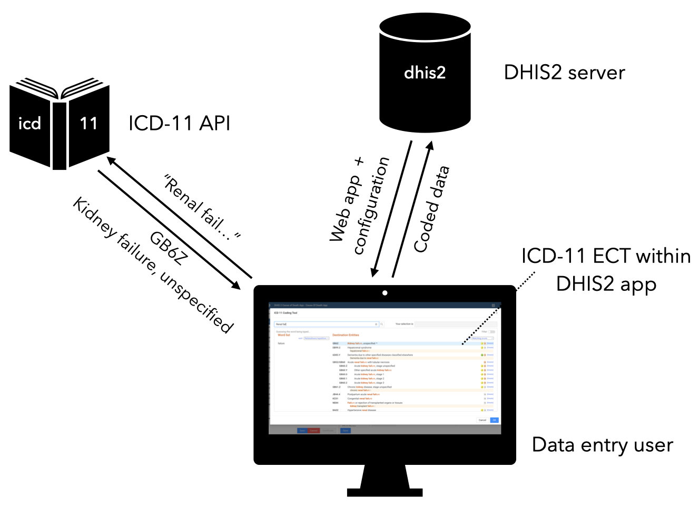
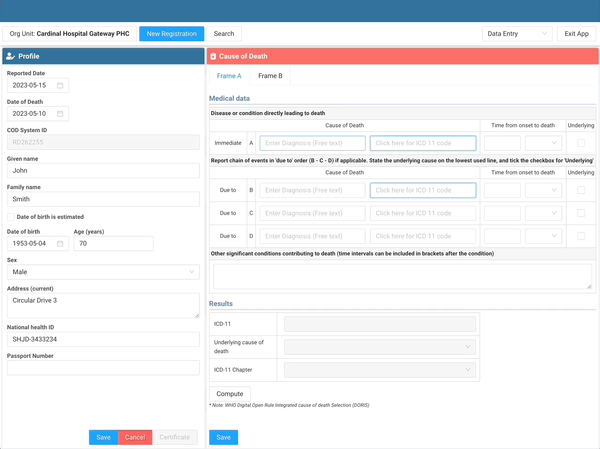
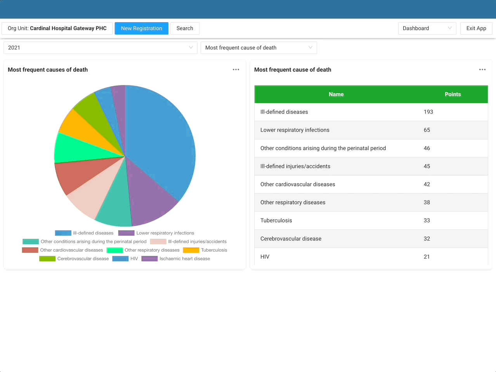

# ICD-11 Cause of Death App

## Overview and Key Features

With the International Classification of Diseases version 11 (ICD-11), WHO has developed a digital search tool that is available as a web-based interface on the WHO [website](https://icd.who.int/ct11), and as a service ([API](https://icd.who.int/icdapi)) that can be integrated in other digital tools. For many countries, integrating cause of death reporting into DHIS2 provides an easier way to allow recording of the cause of death, identifying the underlying cause of death, and enabling trained staff to code the cause of death with the ICD-11 standard. 

In collaboration with WHO, HISP Vietnam has developed the *ICD-11 Cause of Death application* that allows countries to:

1. Integrate Cause of Death reporting in DHIS2 in compliance with the Medical Certificate of the Cause of Death (MCCOD) through manual or custom installation of the recommended standard metadata (depending on the current configuration status of DHIS2 in the country)
2. Facilitate coding of the underlying cause of death using the ICD-11 API and the WHO supported DORIS coding tool
3. Cause of Death Certificate Generation: Generation of customized death certificate with extended options for countries to adopt their specific requirements while maintaining the core data points.
4. DHIS2 Analytics: Standard and custom dashboards based on multiple ICD-11 special mortality tabulation lists, WHO standard analytics and ICD Chapter-wise analysis.
5. Data Export and External Analysis: Allows ANACoD3 real time export for external and enhanced analysis.

 *Data flow between DHIS2, ICD-11 API and a data entry user.*

The app provides a standardized approach to record cause of death information, following the International Statistical Classification of Diseases and Related Health Problems (ICD) guidelines. The app is linked with ICD 11 browser for searching the ICD 11 codes for the cause of death/medical condition entered by the user. Health workers can input data directly into the app, eliminating delays and reducing errors associated with coding in manual register.

## Data entry with ICD-11 integration

Data entry in the CoD application is based on the format of the international medical certificate of cause of death, with one section for demographic data, one section (Frame A) for capture the medical data (i.e. causes leading to death), and one section (Frame B) for additional information on surgeries, the manner of death, and for maternal deaths. The WHO ICD-11 coding tool is embedded within the application, and appears seamlessly when entering information about the diseases/conditions leading to death.

## Underlying Cause of Death & Coding Analytics

The tool allows for manual or automated selection of the *underlying* cause of death, which is used for subsequent analysis and mortality statistics. Automated selection of the underlying cause of death and coding uses the [*Digital Open Rule Integrated cause of death Selection* (DORIS) tool ](https://icd.who.int/doris/tool)developed by embedding the WHO's digital mortality rule base in the app for automated selection of the underlying cause of death. This option can be overridden by the user for manual assignment of the underlying cause of death. For example, in minority of cases the cause of death may not be able to be assigned by the rule engine. Alternatively, specialized experts may review the automated underlying cause of death analyses and adjust. 

## Analytics and Data Export

The CoD application has built-in dashboards providing a set of key mortality visualizations, developed according to WHO specifications. These are displayed through a custom view made available when the app is installed in a DHIS2 instance. Data collected through the CoD application can also be analyzed using the analysis tools built into DHIS2, including charts, maps and tables that can be placed in tailor-made dashboards. The custom dashboards allow for chart types not currently supported in DHIS2 core software, such as bubble maps that demonstrate the . In addition, the custom dashboards allow for automated ranking and display of the top ten causes of death, which is not natively supported by DHIS2 analytics. 

### ANACoD3 Export

For additional analysis of mortality and cause of death data, data can be exported from the CoD app in a format that can be used directly with the [ANACoD3](https://www.who.int/standards/classifications/classification-of-diseases/services/analysing-mortality-levels-and-causes-of-death) tool available from WHO.

## Local adaptation and customisation

The CoD application provides a user interface tailored to capture and analysis of cause of death data. However, the underlying data model is a normal DHIS2 *tracker program*. This means that the mortality data can still be linked to and used together with other data collected in DHIS2. The application uses the international *medical certificate of cause of death* as a baseline for the data capture form, variations of which are used in most countries worldwide. While the core content of this form cannot be changed, it is possible to customize the form, for example with additional demographic data or variables. It is also possible to add a logo and customize a printable version of the certificate.

For countries that have used the DHIS2 Cause of Death tool with SMoL coding, their existing configuration can be adapted and used with the ICD-11 app to facilitate transition to ICD-11. 

For more information on how the underlying tracker program is configured for compatibility with ICD-10, please see the system Design Guide for Cause of Death ICD-10 SMoL. 

