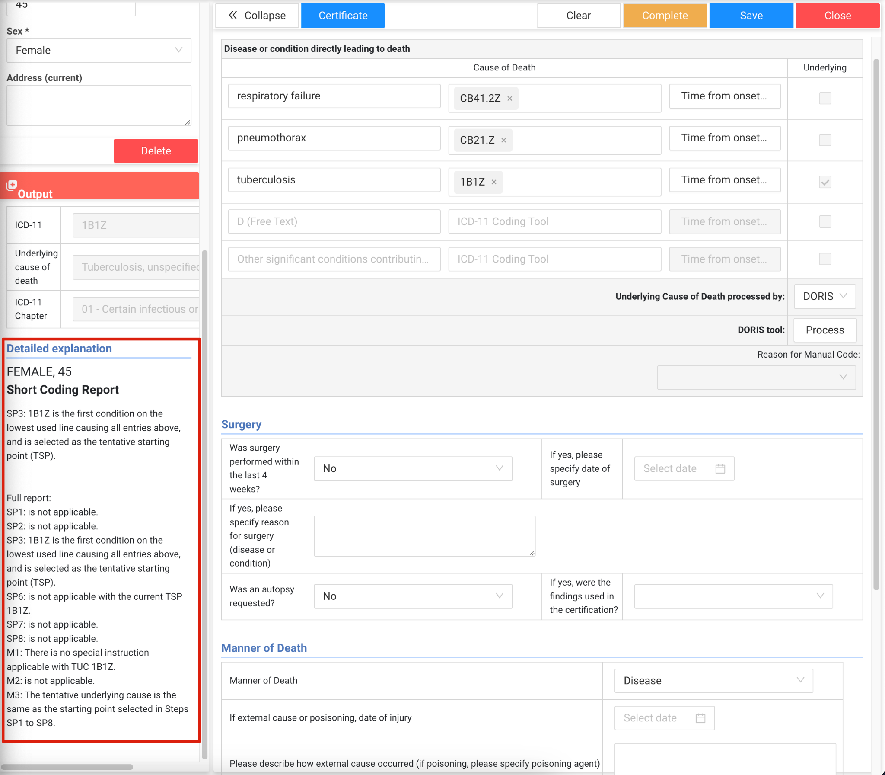

# ICD-11 Cause of Death Mortality App - User Guide

The ICD-11 cause of death app is developed in close collaboration with several partners supporting cause of death data capture and analysis at the local level. It is maintained by HISP UiO and HISP Vietnam through a joint partnership.

The app uses the [international form of medical certificate of cause of death](https://www.who.int/standards/classifications/classification-of-diseases/cause-of-death) as its basis along with the [ICD-11 coding system](https://icd.who.int/en) to codify deaths. It does this through the use of the [DORIS (WHO Digital Open Rule Integrated Cause of Death Selection) API](https://icd.who.int/docs/doris/en/doris-api/), allowing you to directly code your causes of death directly in DHIS2.

Key features of the cause of death app include:

-   Seamless configuration. Install the app using existing tracker metadata from your own instance. If you don't have any, it will set everything up for you.

-   Customizable data entry. Start with the international form of medical certificate of cause of death as your baseline and add sections or data elements as needed.

-   Full access to the ICD-11 coding system. This includes looking up each of the codes, viewing their chapters, and seeing their full definitions.

-   Use of the digital mortality rule engine. This allows you to use DORIS to automate the selection of your underlying cause of death.

-   Cause of death certificate generation. Generate a customized certificate for sharing death details.

-   Custom dashboards. These dashboards allow you to review various analytics related to your underlying cause of death directly in DHIS2.

-   Export to ANACoD3. Full export to ANACoD3 is available, allowing you to perform detailed analysis on your data.

-   Full translation support.

-   Use role based access. Allows for various users to have different levels of access to the modules included within the app.

The app itself consists of 5 separate modules, which will be discussed further in this guide

1.  Data entry

2.  Anacod Export

3.  Dashboard

4.  Administration

5.  Translations

## Data Entry

The Data Entry module opens by default when the app is launched.

### View the programs front page list

To view data that has already been entered, select an organisation unit by clicking on the "SELECT ORGANISATION UNIT" button. An organisation unit hierarchy and a search field will appear, browse the hierarchy by expanding the tree or quickly locate the organisation unit you are searching for by entering its name in the search field.

Once you have selected the organisation unit, a list of the entries enrolled into the selected organisation unit will be displayed. The list is paginated, showing 10 records per page, and supports sorting by all of its columns.

After the list appears, select any record to view or edit its data.

#### Record status

The front page list will have a column for "Status" of the record.

-   Pending: the record has not yet been completed

-   Completed: The record has been completed

This can assist you in finding records that may need further review or need to be completed, as you are able to filter the front page list via the status column.

### Searching

The Data Entry module provides a search feature to quickly find the Tracked Entity Instances (TEIs) already entered in the instance. Select the "SEARCH" button in order to initiate a search.

There are two search options available:

1. Search TEIs in the program: Finds TEIs enrolled in the Cause of Death program.
2. Search TEIs by Tracked Entity Type: Finds TEIs enrolled in other programs.

#### Search TEIs in the Cause of Death program

Choosing the \"Person In Program\" option in the search page allows you to search for Tracked Entity Instances (TEIs) within the program using unique attributes or other searchable attributes. These attributes are pre-defined in the system.

The Cause of Death program always uses the COD System ID as its unique attribute, so there is always an option to search by this attribute.

The second option is Search by attributes, which displays all pre-defined searchable attributes in the Cause of Death program. You can define which attributes are searchable by using the maintenance app in DHIS2 and selecting "Searchable" attributes in the programs "attributes" configuration page.

After entering your search details and performing the search, a list of TEIs is displayed below the search form. Each row includes a \"View\" button in the last column, allowing you to open the selected TEI and view its details.

#### Enrolling from another program

In addition to creating a new Tracked Entity Instance by clicking the \"New Registration\" button, you can search for an existing Tracked Entity Instance (from other programs) using the \"Person\" option on the search page to enroll the searched TEI in the Cause of Death program.

Searching by \"Person\" functions the same way as searching by \"Person in Program\", offering options to search by Unique Attributes and Searchable Attributes.

A list of searched TEIs is displayed below the search form.

The button is labeled \"View\" if the searched Tracked Entity Instance (TEI) is already enrolled in the Cause of Death program. Clicking this button navigates to and opens the TEI in the form.

If the TEI is not yet enrolled in the Cause of Death program, the button is labeled \"Enroll\" and is used to enroll the TEI into the program.

> **Note**: An organisation unit must be selected before enrolling the searched TEI. If no organisation unit is selected, enrollment will not proceed, and an error message will appear.

### Creating a new record

To create a new TEI, select the "NEW REGISTRATION" button, which is enabled only after selecting an organisation unit. This will display the form for registering a new record and entering its new details.

#### Profile Details

When you select \"NEW REGISTRATION\" on the top bar, the form initially displays only the sections in the left sidebar. You must enter data in the Profile section and click the \"Create\" button. After creating a new TEI and Enrollment, the main sections of the cause of death program become visible.

Fields that are marked with an asterisk are mandatory. You can decide which fields are mandatory by configuring this in the DHIS2 maintenance app for the program that is created during the installation procedure.

Fill in the fields in the profile section and select "Create" to create the Tracked entity instance and enroll them into the program.

### The Medical Certificate of Cause of Death Form

The form follows the WHO [international form of medical certificate of cause of death](https://www.who.int/standards/classifications/classification-of-diseases/cause-of-death) format and includes the option to display the result of the underlying cause of death. The result includes ICD-11 Groups and Chapters, along with the explanation of the underlying cause of death, which is determined through the use of the [DORIS (WHO Digital Open Rule Integrated Cause of Death Selection) API](https://icd.who.int/docs/doris/en/doris-api/).

The output and profile sections are positioned in the left sidebar, which can be expanded or collapsed using the "Collapse" button to allow the main section---displaying details from the form itself---to be viewed in fullscreen mode.

#### Medical Data

In the medical data section of the form, Cause of Death A, B, C, D and other significant conditions allow you to store both free text as well as ICD-11 codes. Clicking on a field where it says "ICD-11 Coding Tool" opens the WHO ICD-11 Coding Tool, where you can search for a code by name and view its details.

After selecting a code from the list, it appears in the "Your selection is" text field. Click the "OK" button to add the code to the corresponding Cause of Death field.

You can view further details associated with each code by selecting the "Details" button.

You can see details of the full hierarchy by selecting "see in hierarchy" or any one of the postcoordination "+" buttons.

This functionality is similar to using the [WHO ICD-11 browser](https://icd.who.int/browse/latest-release/mms/en), as the service for the ICD-11 codes is provided by the WHO.

While this is not best practice, the Cause of Death fields support multiple codes, allowing you to add more ICD-11 codes as needed. To remove a code, click the "x" on the tag displaying the code.

##### Time from onset to death

Since the Cause of Death fields support multiple codes, a time from onset to death must be set for each code.

Selecting the "Time from onset to death" button opens a pop-up displaying a list of the selected codes displayed in rows. This pop-up allows you to select the time period and time for each code in its corresponding row.

After setting "Time from onset to Death" for all codes, click the "Set" button to save the values. Hovering over a code's tag of the code will display its detail.

#### Surgery, Manner of Death and Maternal Death Details

Information on surgery, manner of death and maternal deaths (**NB:** the maternal deaths section will only appear when the person's sex is female) is located under the medical details section.

> **Note**: The data here is also used to inform the selection and explanation of the underlying cause of death (UCoD) in the output tab if DORIS is being used to automatically select the UCoD. For this reason, these sections can not be removed during the installation process.

## Determining the underlying cause of death

### Automated selection

In the app, after your data has been entered, you must use DORIS as a first step for selecting the underlying cause of death. To run DORIS, select the "Process" button.

The results from DORIS are displayed in the Output section, which includes the Underlying Cause of Death code,the group and chapter of the underlying cause of death, and the explanation.

**Where possible, it is recommended that the automated selection be used to determine the UCoD.** DORIS incorporates the ruleset of selecting the correct UCoD while also accounting for common errors, for example having an implausible sequence on the certificate, consistencies between the sex and diagnosis, selection of nonspecific modes of death or selection of precise terms and codes.

#### Output considerations/warning messages

The output section will also contain warning messages if items you have filled in are inconsistent with the rules of selecting the UCoD.

Example

-   Congenital tuberculosis is selected as the UCoD, but the manner of death is selected as accident

-   Congenital tuberculosis, a condition associated with infants, is selected as the UCoD, but the age based on the date of birth is 45 years old

Fixing information based on the warnings will result in them no longer appearing.

These warning messages serve as validation for the data being entered into the certificate. Another example might include selecting pregnancy related codes, but the sex is identified as male.

It is a good idea to review, interpret and address these warning messages as they will assist you in coding your death details correctly.

### Manual selection of Underlying Cause of Death

Manual selection is enabled only after the automated selection process has been completed. This option allows you to choose the underlying cause if the result from DORIS is not aligned with your expectation or if the underlying cause has already been determined prior to entering the record in DHIS2.

To manually select the underlying cause of death:

1.  Choose the "Manual" option from the "Underlying Cause of Death processed by" dropdown

2.  Note that you must select "Reason for Manual Code", before saving or completing the form (without this, the form cannot be submitted)

3.  De-select the underlying cause selected by DORIS

4.  Then, check the underlying checkbox in one of the cause of death fields

Since a Cause of Death field may have multiple codes, a pop-up will appear if there is more than one code in the row where you have manually selected the underlying cause of death, allowing you to select which ICD-11 code is for the underlying cause of death.

The output section will be updated based on your selection, but no explanation or warnings will be provided as this is a feature inherent to DORIS.

### The Death Certificate

To display the Death Certificate, select the "Certificate" button on the top bar in the main section.

> **Note**: this button is enabled only when the Underlying Cause of Death is selected and is displayed in the Result section.

A pop-up will appear displaying the pre-defined certificate, with values from the form automatically assigned to their corresponding positions.

You can print the Death Certificate by clicking on the "Print" button in the pop-up.

### Completing and saving records

The "Complete" and "Save" buttons are located in the top bar of the main section on the right side

-   Clicking \"Save\" stores the general information from the profile section into the Tracked Entity Instance and Enrollment, while the data from the main and result sections is saved to the Event. If you attempt to exit the form without saving, a pop-up reminder will appear, prompting you to save before leaving.

-   Clicking \"Complete\" disables all fields in the form and changes the Enrollment status to \"Complete\"

-   Once completed, the button changes to \"Reopen\", allowing you to update information if needed. Clicking \"Reopen\" re-enables the fields and automatically changes the Enrollment status back to \"Active\"

### Unenroll and Delete

The "Delete" button in the Profile section allows to either Unenroll or permanently delete the Tracked Entity Instance. When clicked, a pop-up appears with both options.

When the \"Delete\" option is chosen, a confirmation pop-up will appear. Since the Tracked Entity Instance may be used in other programs, deleting it will also remove its enrollments in those programs.

## ANACoD Export (Must have the View Data permission)

The ANACOD Export feature generates a report in ANACOD format, which can be imported into the WHO Analysing Mortality and Causes of Death [ANACOD](https://anacod-cdn.azureedge.net/v11/#/upload).

-   Select the desired years for the report. (Multiple years can be selected, and the report will display data in separate tabs by year.)

-   Click the \"Run\" button to generate the report.

-   Once the report is displayed, click the \"Anacod Export (CSV)\" button to export the data.

> **Note**: The first two rows of the report will be blank. These rows need to be filled in manually and are reserved for the country\'s population by age/sex breakdowns. Before you upload to ANACoD, make sure these fields are filled in. You can view sample datasets to check the format of your population is correct [here](https://anacod-cdn.azureedge.net/v11/#/upload/form/sample).

Since the country code is required for the ANACOD report, you must select a country if the root organisation unit does have its code. This selection will be stored the first time you open this module.

After you have downloaded your data and added your population information, upload your data to the [ANACoD3 tool here](https://anacod-cdn.azureedge.net/v11/#/upload).

The full user guide for ANACoD3 is available [here](https://anacod-cdn.azureedge.net/v11/#/reference/user-guidance),

## Dashboard (Must have the View Data permission)

The app includes 9 built-in dashboards, which can be selected from the dropdown menu next to the year selection on the top. The data displayed on the dashboard will be updated based on the selected year; while *the USER_organisation unit will be used to apply filters to the data by default*

> **Note**: The dashboards are using data only from the underlying cause of death. If further analysis on causes A,B,C,D, other conditions or surgery, manner of death and pregnancy are needed, it is recommended that the built-in DHIS2 tools be used to generate outputs and dashboards for this purpose.

The dashboards included in the app are the following:

-   Mortality from broad causes of death

    -   Divides the underlying causes of death into the following broad causes:

        -   Communicable

        -   Non-Communicable

        -   External Causes

        -   Ill-Defined

-   Mortality by cause, age and sex

    -   Each chart in this dashboard corresponds to a specific cause group, which can be selected from the dropdown menu located beneath the year and dashboard menu

-   Mortality from NCDs

    -   Categorises deaths by age,sex and period due to NCD categories

        -   Malignant neoplasms

        -   Diabetes mellitus

        -   Cardiovascular diseases

        -   Respiratory diseases

-   Most frequent cause of death

    -   Displays information on the top-10 causes of death

-   Deaths by ICD-11 chapter

    -   Displays the relative proportion of deaths (as compared to the overall total) by ICD-11 chapter

-   Deaths by specific disease:

    -   Set of 4 dashboards focusing on deaths by specific diseases

        -   Malaria

        -   TB

        -   AIDS

        -   Malaria - TB- AIDS combined

## Administration (Must have the Administration permission)

In the Administration module, additional attributes can be added to the registration details of the form (specifically the Profile section of the Data Entry form) by selecting attributes in the transfer table on the right side.

It will display the attributes you have created in maintenance and allow you to use them in the program as needed.

### Certificate

The Administration module also allows you to configure the Certificate, allowing you to change the header, update the logo, and add or delete attributes, data elements, and other content within the certificate. To navigate to the certificate, from the administration module select "Next" when in the attributes page.

#### **The default certificate** 

This does not use a template and consists of a basic page with a title, body, and footer. In the title section, you can add a logo for the certificate by uploading an image.

In the body and footer section, you can include all data related to the Cause of Death program, such data elements, attributes, event date, enrollment date, and organisation unit. You can also rearrange their order using the up and down arrows.

#### **The custom certificate** 

This allows you to use a template selected uploaded as a DHIS2 resource (you can upload a resource via the DHIS2 reports app) by selecting from the "Template UID" dropdown, then clicking the "Change Template" button to store the resource UID for the template.

By clicking the "Add" button, you can then add the custom values at the appropriate places in the template. You assign the location of fields through the use of the pixel coordinates based on the template that you have uploaded. The custom certificate supports two types of values: text and check mark.

The text value type can be used to combine multiple values, including attributes, data elements, organisation unit, as well as event and enrollment dates.

To retrieve the required data for the custom certificate template, follow the format below:

Data Element: #{de.\[UID\]}

Tracked Entity Attribute: #{tea.\[UID\]}

Organisation Unit: #{organisation unitName}

Enrollment Date: #{enrollmentDate}

Event Date: #{incidentDate}

The list of the custom values you create will be displayed on the left side, while the certificate template with the custom values will be shown on the right side.

Note: Click the \"Preview\" button each time you want to view changes in the template.

The "Delete" button is used to remove the custom certificate and revert to the default certificate.

## Translation (Must to have the Administration permission)

To support multiple languages, the app allows users to add and update translations for different languages. It will automatically use the DHIS2 interface language settings to display the appropriate translation. The translations are displayed in tabs, with each tab representing a module of the app. Within each tab, the translations are displayed in a table, where the first column represents the keys and additional columns represent the corresponding languages.

To add a new language for translation, click the "Add Language" button. A popup will appear with a dropdown list of available languages for selection. The translations for the selected language will appear in the last column of the table.

> **Note**: If the selected language is French or Arabic, translations will already be available, as the app currently includes French and Arabic translations in its resources. For other languages, you have to add the translation to the appropriate key.

To simplify the translations process, you can export translations as a CSV file by clicking the "Export Translations" button and selecting the desired language for export. In the exported file, you can add translations in the relevant column, matching them to the corresponding keys. Once all translations are added, import the file back into the app using the "Import Translations" button.

